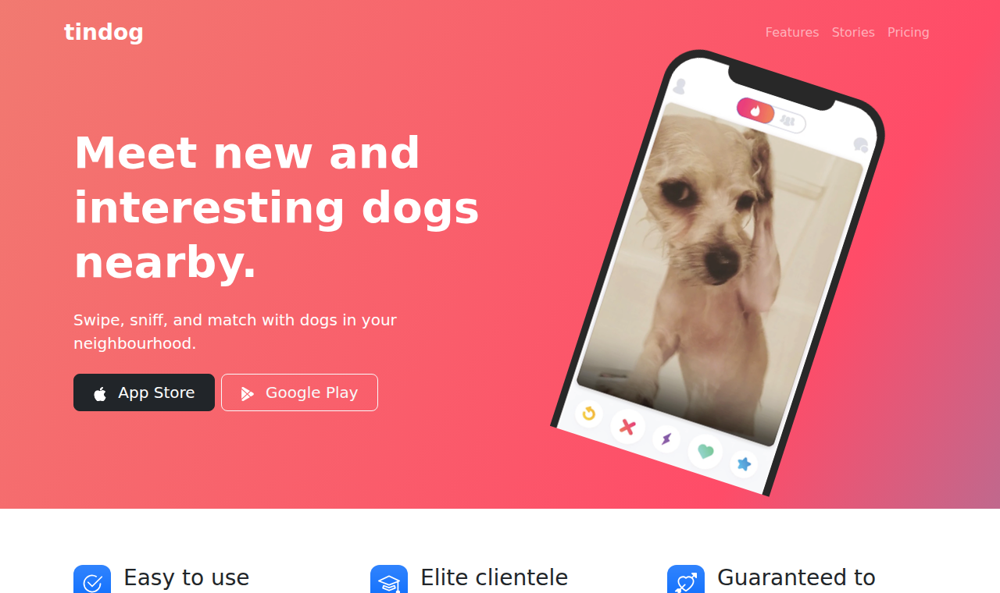
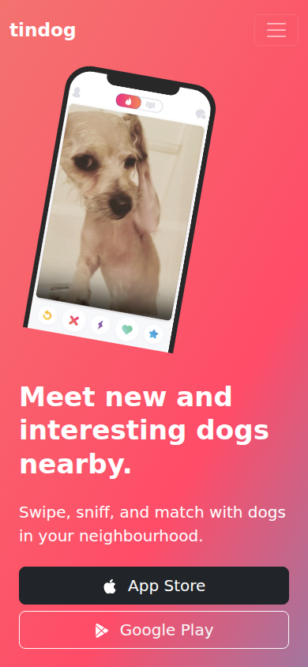

# TinDog

[](https://github.com/FuaadBashi/TinDog-WebPage/actions/workflows/ci.yml)

A responsive landing page for a fictional dog-dating app, built with HTML, CSS and Bootstrap 5.

<p align="center">
  
  &nbsp;
  
</p>

## Highlights

- **Responsive from phone to desktop.** Bootstrap's grid, a collapsing navbar, and a hero that
  reflows so the phone mock-up sits above the headline on small screens.
- **Animated gradient.** A slow, looping CSS keyframe animation shifts the hero and footer
  gradient.
- **Semantic, valid HTML.** `header`, `nav`, `main`, `section`, `figure`/`blockquote`/`figcaption`
  for the testimonial, and descriptive `alt` text. CI checks the page with
  [html-validate](https://html-validate.org) and confirms every local asset path exists.
- **No build step.** Bootstrap loads from a CDN with Subresource Integrity hashes.

## Run locally

```bash
git clone https://github.com/FuaadBashi/TinDog-WebPage.git
cd TinDog-WebPage
python3 -m http.server 8000   # then open http://localhost:8000
```

Or open `index.html` directly in a browser.

## Structure

```
index.html      the page
css/style.css   gradient animation, icon tiles, hero and logo styling
images/         phone mock-up, testimonial photo, press logos, store icons
```
